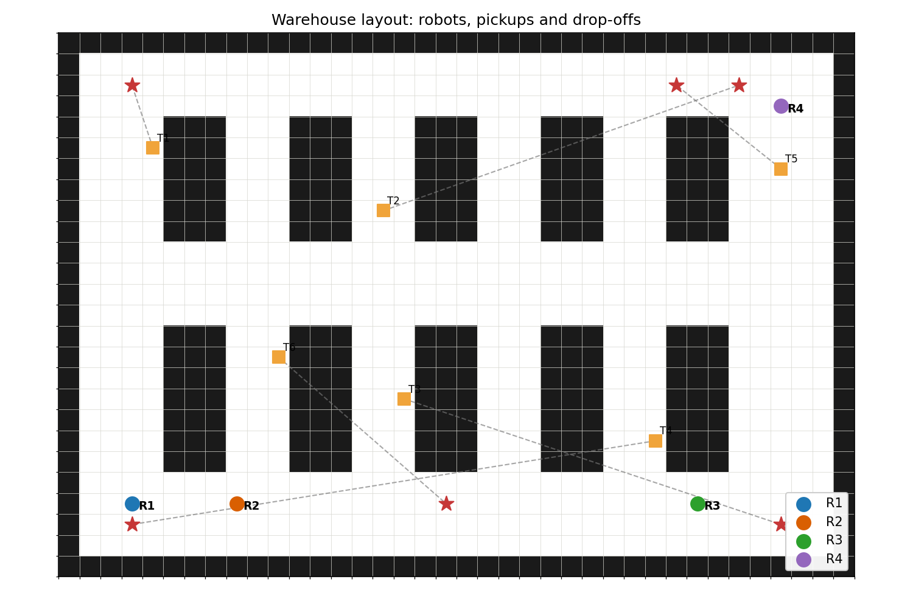
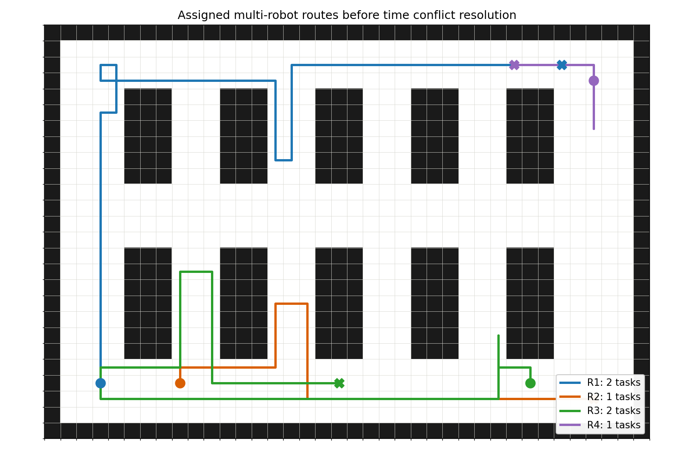
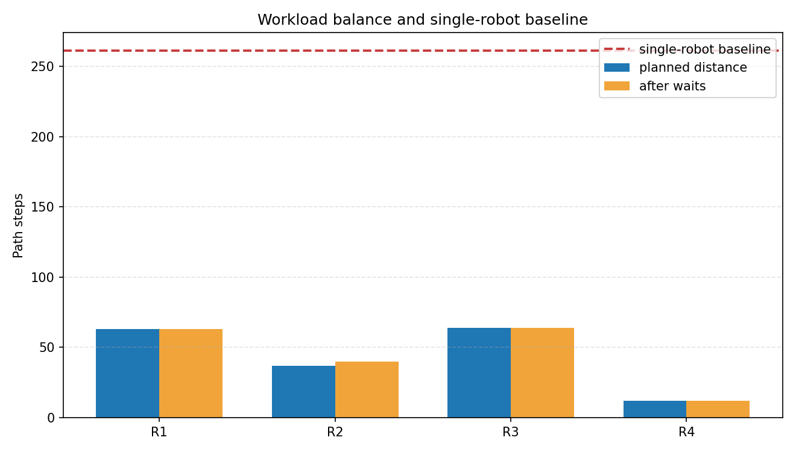
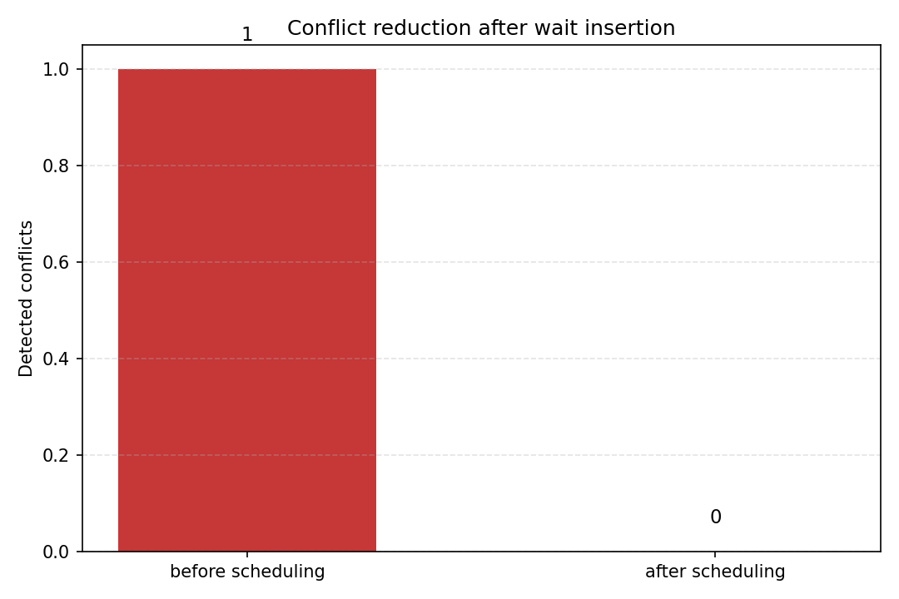
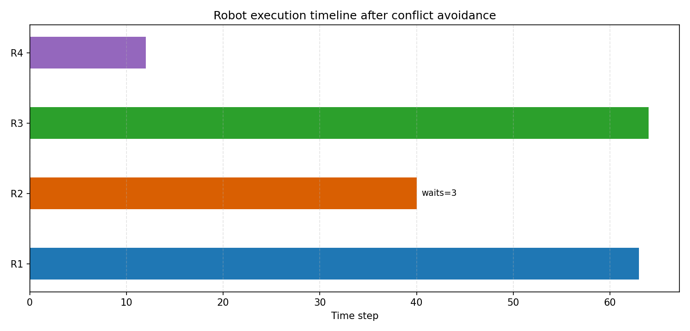
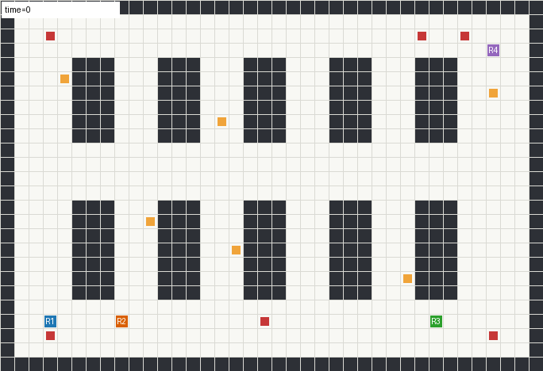

# 多机器人仓储协同调度与避碰汇报

## 1. 项目背景

`nn` 项目中已有不少机器人、无人车和导航相关模块。本次通过审核的项目是 `warehouse_robot_coordination`，它面向智能仓储场景，模拟多台机器人在货架通道中执行取货与投放任务。

与单机器人路径规划不同，本项目重点不只是“找到一条路”，而是解决多机器人同时运行时的任务分配、路径规划、冲突检测和时空避碰问题。

## 2. 项目目标

本项目目标是做一个完整的多机器人协同调度演示模块，包括：

- 仓储地图建模。
- 多机器人与 pickup-delivery 任务建模。
- A* 路径规划。
- 优先级感知的任务分配。
- 多机器人路径冲突检测。
- 顶点冲突与边交换冲突识别。
- 插入等待动作进行时空避碰。
- 多机器人方案与单机器人基线对比。
- 图片、图表、GIF 和指标文件输出。

## 3. 模块位置

```text
src/warehouse_robot_coordination/
```

项目结构如下：

```text
src/warehouse_robot_coordination/
├── main.py                  # 命令行入口
├── warehouse.py             # 仓库地图、机器人和任务定义
├── planner.py               # A* 路径规划、任务分配、单机器人基线
├── scheduler.py             # 时空冲突检测与等待避碰
├── visualization.py         # 图片、图表和 GIF 生成
├── requirements.txt         # 依赖说明
├── README.md                # 项目说明
├── assets/                  # 运行结果
└── tests/test_coordination.py
```

## 4. 核心算法流程

### 4.1 仓库地图建模

`warehouse.py` 构建了一个二维仓储地图：

- `0` 表示可通行区域。
- `1` 表示货架或墙体。
- 地图中包含货架区、横向通道、装卸区域。
- 共有 4 台机器人和 6 个取货投放任务。

### 4.2 任务分配

`planner.py` 中先按任务优先级排序，然后对每个任务计算不同机器人完成该任务的路径代价。

任务分配时综合考虑：

- 机器人当前位置到取货点的距离。
- 取货点到投放点的距离。
- 当前机器人已经分配的任务数量。
- 任务优先级。

这样可以避免所有任务都集中到一台机器人身上。

### 4.3 路径规划

每段路径都使用 A* 规划，包括：

- 机器人当前位置到取货点。
- 取货点到投放点。

A* 使用曼哈顿距离作为启发式函数，适合二维栅格仓库地图。

### 4.4 时空冲突检测

`scheduler.py` 会把每台机器人的路线展开成按时间步排列的轨迹，并检测两类冲突：

- 顶点冲突：两台机器人在同一时间进入同一个格子。
- 边交换冲突：两台机器人在相邻时间步互换位置，容易发生迎面碰撞。

### 4.5 等待避碰调度

当检测到冲突后，调度器会给其中一台机器人插入等待动作，让另一台机器人先通过窄通道。

本次运行中，冲突数量从 `1` 降为 `0`，说明调度后多机器人路径可以无冲突执行。

## 5. 运行方法

进入模块目录：

```bash
cd src/warehouse_robot_coordination
python main.py
```

运行后会生成：

```text
warehouse_task_map.png
assigned_routes.png
workload_balance.png
conflict_reduction.png
robot_timeline.png
warehouse_coordination.gif
metrics.json
robot_loads.csv
```

## 6. 运行结果

### 6.1 仓库任务分布图

下图展示仓库地图、货架、机器人起点、取货点和投放点。



这张图可以说明本项目不是随机画线，而是在一个具有货架和通道结构的仓库环境中进行调度。

### 6.2 多机器人路线图

下图展示任务分配后，每台机器人的完整行驶路线。



可以看到，不同机器人承担不同任务，路线分布在仓库不同区域，避免了单机器人执行所有任务造成的效率低下。

### 6.3 负载均衡对比图

下图比较多机器人计划路径、加入等待后的路径，以及单机器人完成全部任务的基线距离。



本次运行指标：

```text
Robots: 4
Tasks: 6
Total planned distance: 176
Scheduled makespan: 64
Single robot baseline distance: 261
```

可以看到，多机器人协同后，整体执行时间明显低于单机器人基线。

### 6.4 冲突消除图

下图展示调度前后的冲突数量变化。



本次运行中：

```text
Conflicts before/after: 1 -> 0
Inserted waits: 3
```

说明通过插入 3 次等待动作，系统消除了多机器人路径冲突。

### 6.5 多机器人执行时间线

下图展示每台机器人调度后的执行时间线。



这张图适合说明多机器人不是同时无序运动，而是经过时间维度调度后有序执行。

### 6.6 多机器人协同 GIF

下图展示多机器人在仓库中的协同运行过程。



GIF 中可以直观看到机器人在货架通道内移动，并按照调度结果执行任务。

## 7. 运行指标

本次运行结果如下：

```text
Warehouse robot coordination demo finished
Robots: 4  Tasks: 6
Total planned distance: 176
Scheduled makespan: 64
Single robot baseline distance: 261
Conflicts before/after: 1 -> 0
Inserted waits: 3
R1: T1, T2
R2: T3
R3: T4, T6
R4: T5
```

各机器人负载：

```text
R1: 63 steps
R2: 40 steps
R3: 64 steps
R4: 12 steps
```

## 8. 工程量说明

本模块包含：

- 5 个 Python 核心源码文件。
- 1 个测试文件。
- 1 个 README 项目说明。
- 1 个 requirements 依赖文件。
- 6 个可视化成果文件。
- 2 个指标文件。
- 1 个 GIF 动图。
- 1 个 MkDocs 汇报页面。
- 1 个演讲提纲页面。

它不是简单脚本，而是完整的多机器人调度工程模块。

## 9. 测试验证

已完成语法检查：

```bash
python -m py_compile main.py warehouse.py planner.py scheduler.py visualization.py tests/test_coordination.py
```

已运行模块测试：

```text
warehouse_robot_coordination tests passed
```

测试覆盖内容包括：

- 仓库地图合法性。
- A* 是否能到达任务点。
- 任务是否全部分配且不重复。
- 多机器人 makespan 是否优于单机器人基线。
- 冲突调度后是否消除冲突。
- 顶点冲突检测是否有效。

## 10. 汇报重点

上台汇报可以按这个顺序讲：

1. 这是一个智能仓储多机器人协同调度项目。
2. 展示仓库任务分布图，说明场景建模。
3. 展示路线图，说明任务分配和路径规划。
4. 展示负载均衡图，说明多机器人优于单机器人基线。
5. 展示冲突消除图，说明调度前后冲突从 1 降到 0。
6. 展示时间线图，说明多机器人按时间有序执行。
7. 展示 GIF，说明项目可以直观演示运行过程。

## 11. 项目意义

该模块面向智能物流与仓储机器人场景，可作为后续扩展的基础：

- 加入任务截止时间。
- 加入机器人电量与充电站调度。
- 引入 CBS 等多智能体路径规划算法。
- 接入 ROS、Gazebo、Webots 或真实 AGV 调度系统。

## 12. 小结

本项目完成了从仓储地图建模、任务分配、路径规划、冲突检测、避碰调度到可视化展示的完整流程。

相比静态单机器人路径规划，它更强调多机器人协同和工程化调度，更符合智能仓储场景中的实际问题。
